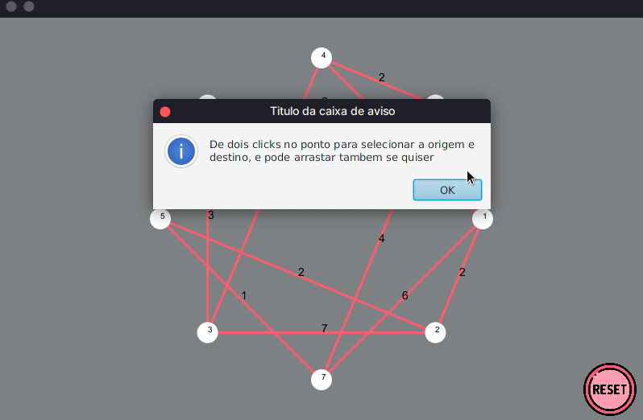

<<<<<<< HEAD
# Algoritmo de Dijkstra

# Contexto

Esse trabalho com um problema de roteamento, utilizou o algoritmo de djikstra para encontrar o menor caminho entre dois pontos, com um grafo não-dirigido para representar uma rub-rede
=======
# Algoritmo de Dijkstra

# Contexto

Esse trabalho com um problema de roteamento, utilizou o algoritmo de Dijkstra para encontrar o menor caminho entre dois pontos, com um grafo não-dirigido para representar uma rub-rede
>>>>>>> 6bb9b620ebc195dd74b815110d62b9f93ffb9193

### Status do projeto: FINALIZADO

## Técnologias usadas

Java 8, JavaFX

## Instalando Dependências

necessita a instalação do java 8

* Para instalar no Windows
```
https://www.oracle.com/br/java/technologies/javase/javase8-archive-downloads.html
  ```
* Para instalar no linux
```
  sudo add-apt-repository ppa:webupd8team/java
  sudo apt-get update
  sudo apt-get install oracle-java8-installer
  
  ```
## Executando aplicação

* Digite no terminal
```
  Javac Principal.java
  java Principal
```



